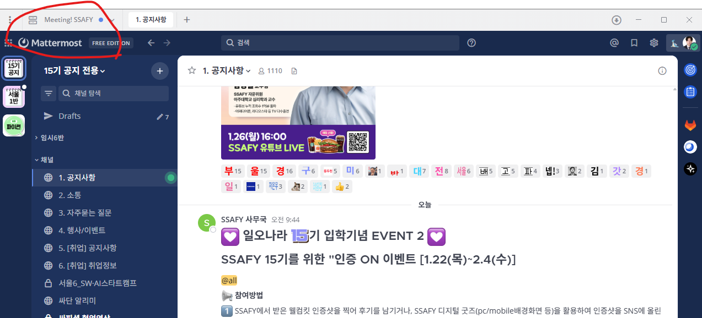
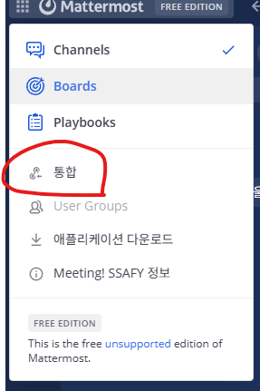
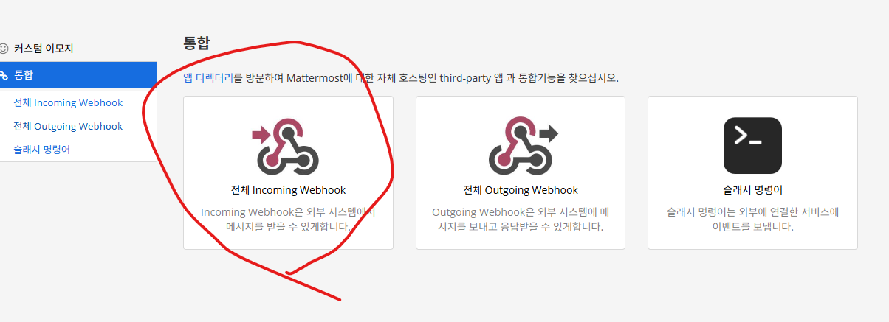
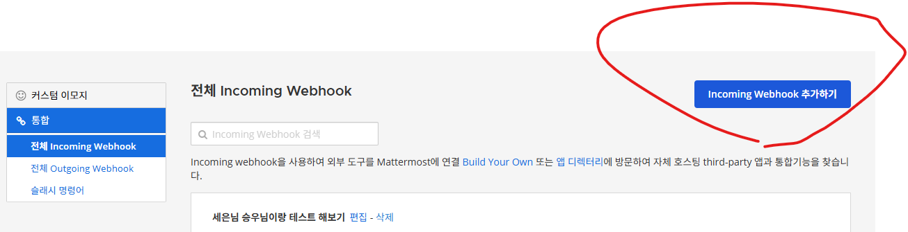
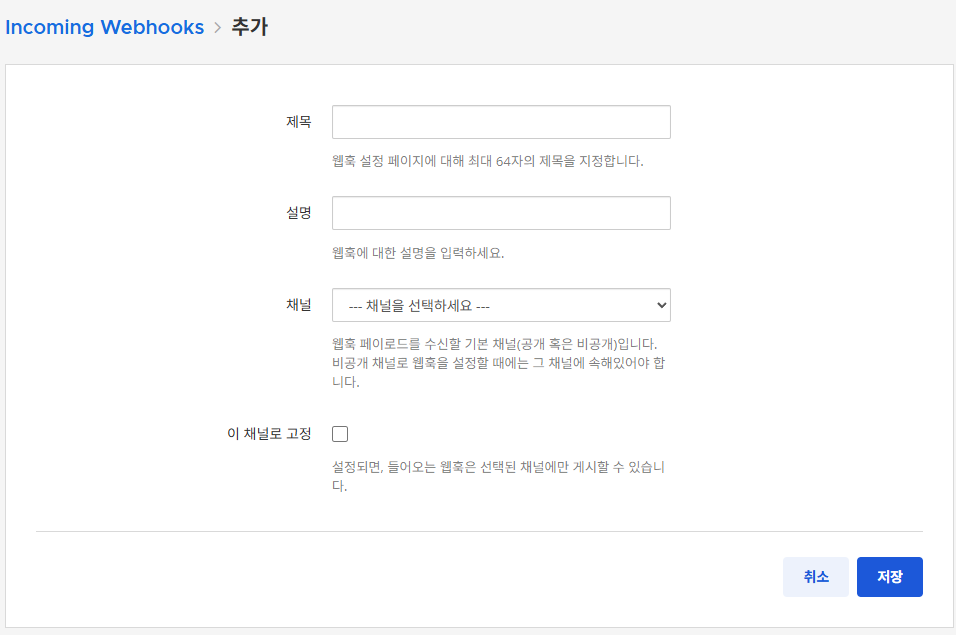
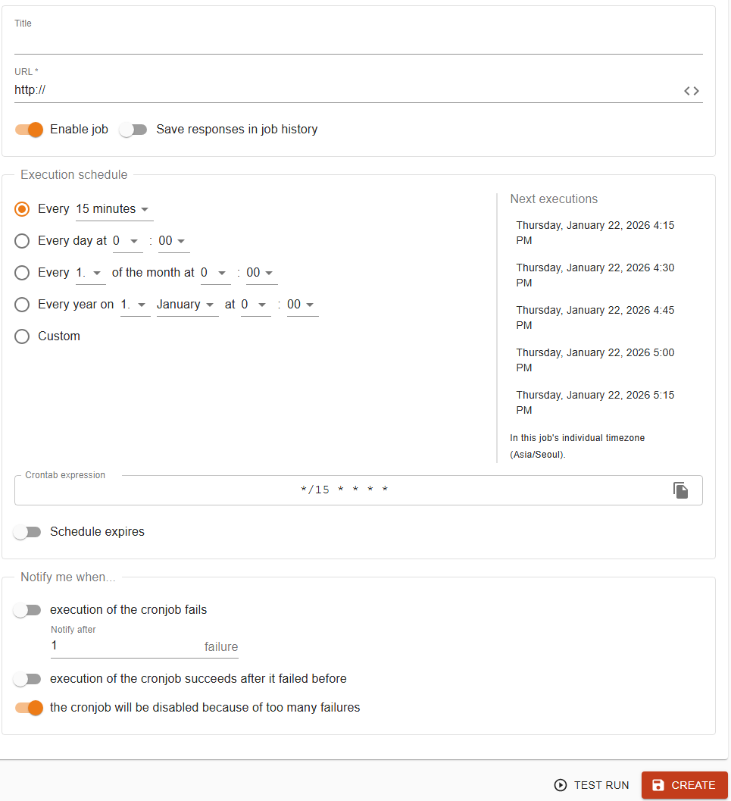
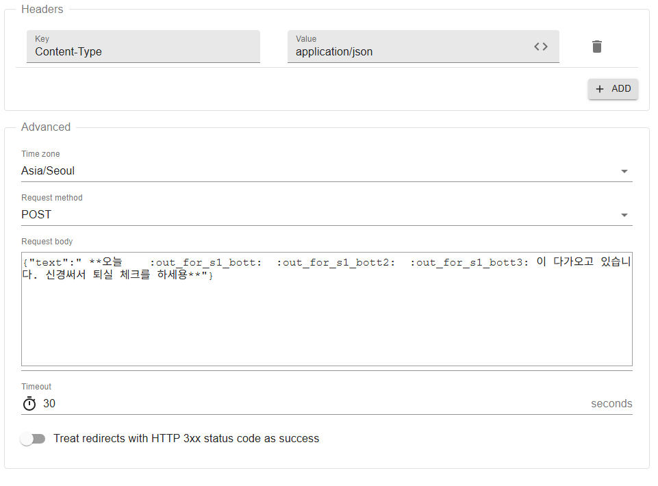

# 오늘은 mm을 활용해서 알림 챗봇을 만들었습니다!!!
약간 디스코드 처럼 걍 인컴을 연결해서 시간이 되면 알림을 주는 그런 방식으로 개발 했습니다.

이게 채널별로 만들어서 운영할 수 있는 구조더라구요.

## 1. INPUT URL발급하기
### 1-1. 메타모스트 버튼 누르기

해당 버튼을 누르면 다음 버튼을 누릅니다.
### 1-2. 통합버튼 누르기

### 1-3. 인커밍 웹훅 누르기

### 1-4. 인커밍 웹훅 추가하기

### 1-5. 인커밍 웹훅 내용 입력 후 저장

### 1-6. 이후 생기는 url을 활용해 웹훅을 넣을 수 있습니다.

## 2. cron-job 활용한 시간 세팅
### 2-1 회원가입 후 create cron job

필요한 정보들을 채워 넣어주세요
여기서  **URL** 은 아까 생성한 MM웹훅 링크를 달아주세요. 

또한 필요에 따라 시간 등 설정을 수행합니다.

### 2-2 다음으로 어드벤스드 탭에서 다음 내용을 넣습니다.

### 2-3 테스트 해보고  실제로 적용해주시면 됩니다!!

# 끝!
## 여러분도 MM을 활용해 다양한 챗봇을 만들어 저희를 즐겁게해주세요.