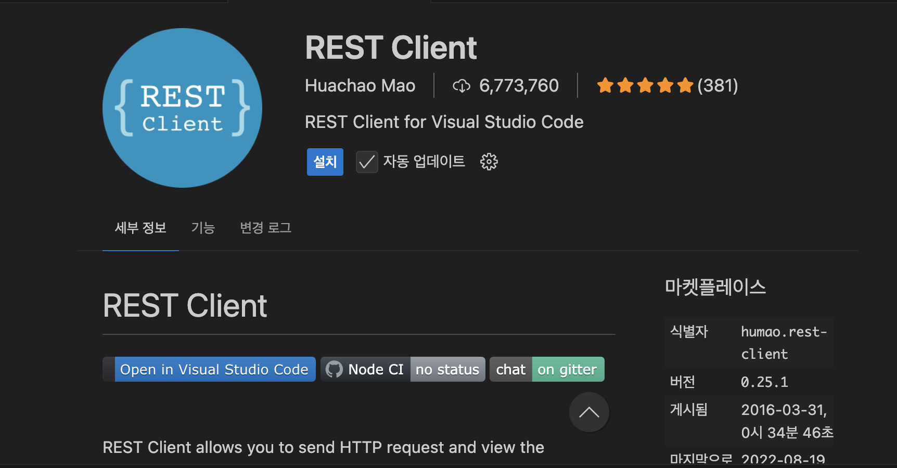

# 많은 확장팩들...
오늘은 요즘 코딩하면서 많이 유용하다고 느낀 것들을 올려보고자한다.

1.  **kiro-cli** 
나 진짜 적잖이 충격 받았다.
아니 커멘드 창에서 이렇게 쉽게... 정보들을 찾을 수 있다는 사실이 놀라웠다.

난 맨날 cd치고확인하고...여간 귀찮은게 아니었는데

덕분에 문제 해결이다.

2. REST-extention

사실 이걸 이제 알았다는 사실이 내가 웹 개발에 끈이 짧다는 것에 대한 증명이라는 생각이든다.

~~아니 근데 나 그냥 swager 면 충분하다고 생각...~~

아무튼 이걸 사용하면 만들어둔 API요청이 똑바로 가는 지 안가는지 눌러보고 확인할 수 있다.

오늘은 이걸 이용해서 간단하게 내가 만든 자바 코드가 진짜 실행이 되는지 안되는지 알 수 있었다.

암튼 그랬다.

오늘의 익스텐션 소개는 여기까지!