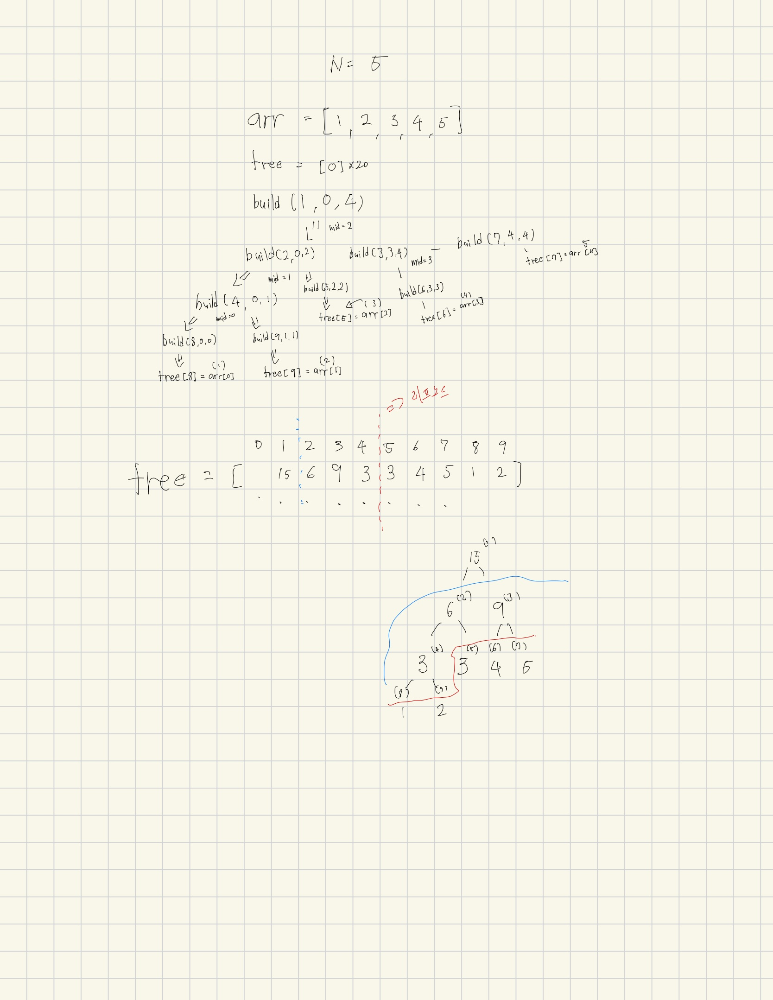

# 세그먼트 트리

오늘은 세그먼트 트리를 배웠습니다.

사실 지금 개념은 적당히 이해한 것 같은데 이걸 어떻게 구현해야할지를 모르겠습니다.

B형을 따겠다고 꺼드럭대던 저이지만 이것도 못풀면서 뭔 B형이냐 싶습니다.


아무튼 지씨의 코드를 보면서 오늘은 공부를 하는 걸로 마치겠습니다.


```python


import sys
input = sys.stdin.readline

N, M, K = map(int, input().split())
arr = [int(input()) for _ in range(N)]

tree = [0] * (4 * N)


def build(node, start, end):
    if start == end:
        tree[node] = arr[start]
        return
    
    mid = (start + end) // 2
    
    build(node * 2, start, mid)
    build(node * 2 + 1, mid + 1, end)
    
    tree[node] = tree[node * 2] + tree[node * 2 + 1]


def update(node, start, end, index, diff): # 내 자리들을 찾아가면서 차이를 엄데이트 해준다.
    if index < start or index > end:
        return
    
    tree[node] += diff
    
    if start != end:
        mid = (start + end) // 2
        
        update(node * 2, start, mid, index, diff)
        update(node * 2 + 1, mid + 1, end, index, diff)


def query(node, start, end, left, right):
    
    if right < start or left > end:
        return 0
    #짤려서 들어온 결과가 원하는 부분 안쪽에 있다면? 나를 출력해라....
    if left <= start and end <= right:
        return tree[node]
    
    mid = (start + end) // 2
    # 완전히 포함 되어있는게 아니라면 반으로 나눠서 또 물어봐야지 모
    return query(node * 2, start, mid, left, right) + \
           query(node * 2 + 1, mid + 1, end, left, right)


build(1, 0, N - 1)


for _ in range(M + K):
    
    a, b, c = map(int, input().split())
    
    if a == 1:
        b -= 1
        diff = c - arr[b]
        arr[b] = c
        update(1, 0, N - 1, b, diff)
    
    else:
        b -= 1
        c -= 1
        print(query(1, 0, N - 1, b, c))

```

뭐가 어찌 되었건 이 부분은 제가 결국 손으로 한번 울면서 클론 코딩이라도 해야만 이해가 될 것 같은 부분이라 내일 공부를 하면서 해보도록하겠습니다.


--- 빌드 과정을 이해하기 위해서 그림을 그려보았어용



다음은 업데이트와 쿼리 이해그림 그리기 입니다....