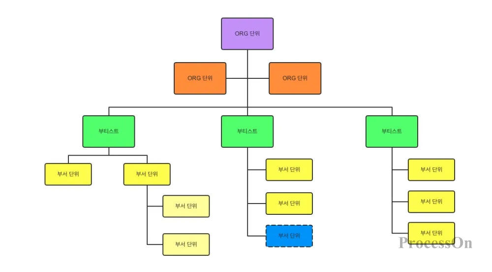

# What is the Class?
### 쉽게 얘기하자면 '집합'
- 코드 내에서 빈번하게 반복되는 코드들을 묶어 변수로 관리하는 느낌
- 전화번호부를 코드로 만든다고 할 때
```python
name = 'name'
phone_number = 'num'
```
 name 과 phone_number 는 모든 객체에 대해 존재해야 한다. 그러면 코드는 다음과 같아짐
 ```python
 dave_name = 'dave'
 dave_phone_number = 'xxx-xxx'
 ```
 모든 객체에 대해 _name 과 _phone_number 가 붙어야하는데 지금은 요소가 두 개 밖에 없으니 망정이지 수가 많아질 수록 감당할 수 없어짐

 그래서 **Class**의 등장
 ```python
 class phone_number:
    def __init__(self, name, number)
        self.name = name
        self.phone_number = number

Dave = phone_number(dave, 'xxx-xxx')
```
이렇게 코드를 작성하면 추후 편하게 관리할 수 있다.

굉장히 단순화해둬서 큰 차이가 없어보이지만 단순히 생각해서 관리해야하는 요소가 100개가 넘어가고 분류해야할 것들이 늘어나면 반드시 필요해지는 개념

## 조직의 조직구성도랑 비슷하다.



각 네모 하나하나가 **Class** 라고 생각하면 가장 하위의 객체라고 할지라도 가장 상위 클래스에 포함되어있다. 회사라고 한다면 **같은 회사에 다니는 사람들 중 같은 부서에 속해 있는 사람들 중 같은 팀에 속해 있는 사람들 중 한 명**.

모두 다 다르지만 소속은 같고 그로 인해 공통되는 특징, 곧 정보가 존재하며 이 정보들을 한 데 묶어 관리한다고 이해했다.

