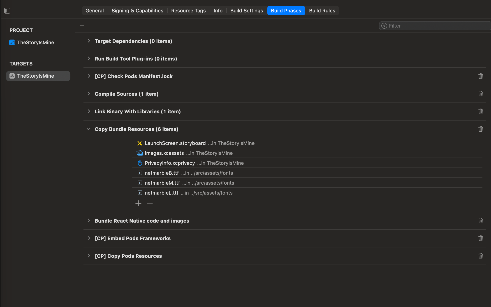
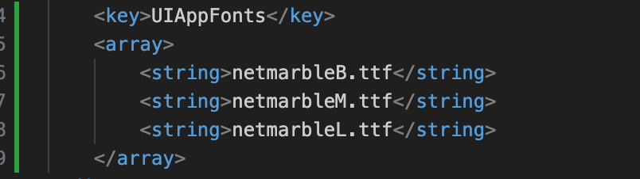
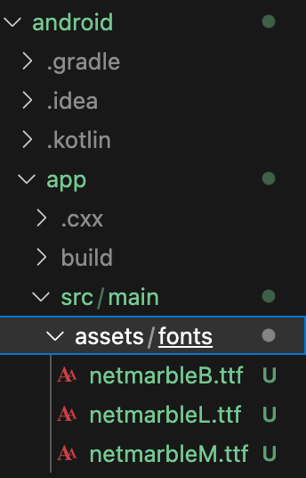

## React Native로 진입화면 만들기

### 1. 프로젝트 구조를 정하자

개발 초반에는 파일 수가 적어 보이지만, 화면이 늘고 기능이 추가될수록 파일은 빠르게 증가한다.

이때, 명확한 디렉토리 구조가 없으면, “파일을 어디에 두지?”라는 고민이 반복되고 유지보수 비용도 커진다.

```text
src/
├─ assets/        # 이미지, 아이콘, 폰트 등 정적 자원
├─ constants/     # 공통 상수 (색상, 문자열, 고정 값)
├─ components/    # 재사용 가능한 UI 컴포넌트
├─ screens/       # 화면 단위 컴포넌트
├─ navigation/    # 화면 이동 및 내비게이션 설정
├─ services/      # API 호출, 외부 통신 로직
└─ utils/         # 간단한 헬퍼 함수
```

### 2. 공통 UI 컴포넌트 넣어 두기

디자인 작업은 보통 피그마에서 먼저 진행된다.

한 번 정한 컬러, 타이포그래피, 간격 규칙은 앱 전체에서 반복해서 사용된다.

이 값들을 컴포넌트마다 직접 적기 시작하면, 나중에 디자인 수정이 들어왔을 때 모든 파일을 열어야 하는 상황이 발생할 것이다.

그래서 다음과 같은 원칙을 따른다.

- 디자인 규칙은 constants에 모은다.
- 컴포넌트에서는 “값”이 아니라 “의미”를 사용한다.

<br>

> `/src/constants`
> 
- `/src/constants/Colors.ts`

```tsx
export const Colors = {
    // basic color
    white: '#ffffff',
    black: '#000000',
    transparent: 'transparent',

    // text color
    textMain: '#4E342E',
    textBody: '#A1887F',

    // brand color
    orange: '#FFAB40',
    lightOrange: '#FFE0B2',
    creamYellow: '#FFF3E0',

    // background color
    overlayGray: '#4E342E66',

    // UI 요소 색상
    borderGray: '#e5e7ec',

} as const;
```

- `/src/constants/Typography.ts`

```tsx
export const TypoGraphy = {
    fontWeight: {
        regular: '400',
        medium: '600',
        bold: '700',
        extrabold: '800',
    },
    fontSize: {
        heading1: 40,
        heading2: 32,
        heading3: 24,
        body1: 16,
        body2: 14,
        caption: 12,
        buttonL: 18,
        buttonM: 16,
        buttonS: 14,
    },
    lineHeight: {
        heading1: 48,
        buttonL: 24,
        buttonM: 20,
        buttonS: 18
    }
} as const;
```

### 3. 정적 파일은 한 곳에 모아두자

이미지, 폰트, 아이콘처럼 빌드 시점에 포함되는 정적 파일은

모두 `assets` 폴더 아래에 모아두는 것이 관리하기 좋다.

```text
/src/assets
├─ fonts
└─ images
```

<br>

> 폰트 적용 과정
> 

React Native에서 커스텀 폰트를 사용하려면 android/ios에 폰트를 명시적으로 등록해야 한다.

1️⃣ src/assets/fonts에 폰트 파일 넣기


2️⃣ Typography.ts 에 추가

```bash
export const TypoGraphy = {
    fontFamily: {
        system: 'System',
        light: 'netmarbleL',
        regular: 'netmarbleM',
        bold: 'netmarbleB',
    },
} as const;
```

3️⃣ react-native.config.js 생성

이 파일은 어떤 정적 자산을 네이티브 프로젝트에 연결할 것인지를 React Native CLI에 알려주는 설정 파일이다.

```tsx
module.exports = {
    project: {
        android: {},
        ios: {},
    },
    assets: ['./src/assets/fonts/'],
}
```

4️⃣ 폰트 자동 연결

```bash
npx react-native-asset
```

- Android: android/app/src/main/assets/fonts
- iOS: ios/appName/Info.plist

에 자동으로 폰트가 등록된다.

```bash
# 결과
Linking assets in /Users/yujeongee/study-develop/react-native/TheStoryIsMine

Linking ttf assets to Android project

Linking ttf assets to iOS project

ERRGROUP Group 'Resources' does not exist in your Xcode project. We have created it automatically for you.
```

5️⃣ 잘 등록됐는지 확인

- Xcode에서 Resources 파일 확인


- Xcode에서 Build Phases > Copy Bundle Resources 확인



- Info.plist 파일 확인



- `android` ➜ `app` ➜ `src` ➜ `main` ➜ `assets` ➜ **`fonts` 확인**



6️⃣ iOS 의존성 업데이트

```bash
cd ios
pod install
cd ..
```

7️⃣ Gradle Clean

안드로이드는 한 번 빌드한 건 기억해두자는 습성이 강해서, 폰트 파일을 새로 넣어도 캐시를 계속 보여줄 때가 많다고 한다.

그래서 청소를 한 번 때려줘야 한다.

```bash
cd android
./gradlew clean
cd ..
```

iOS와 Andorid 모두 잘 적용된 것을 확인할 수 있다.


> `RRGGBBAA` 구조 - 자주 쓰는 알파값
> 

| 투명도 | Hex |
| --- | --- |
| 100% | FF |
| 90% | E6 |
| 80% | CC |
| 70% | B3 |
| 60% | 99 |
| 50% | 80 |
| 40% | 66 |
| 30% | 4D |
| 20% | 33 |
| 10% | 1A |
| 0% | 00 |

### 4. 내비게이션

React Native에서 화면 전환은 React Navigation 라이브러리를 사용한다.

1️⃣ 스택 내비게이션과 react-native-geture-handler 등록

```bash
yarn add @react-navigation/stack react-native-gesture-handler
# @react-navigation/stack: 책갈피(스택) 기능
# react-native-gesture-handler: 화면을 손가락으로 밀어서 뒤로 가기 등을 할 때 필요한 필수 도구
cd ios && pod install && cd ..
```

```tsx
// index.js
import 'react-native-gesture-handler';
```

이 라이브러리는 스와이프, 뒤로 가기 제스처, 내비게이션 전환 애니메이션 등 제스처 기반 동작을 안정적으로 처리하기 위한 필수 의존성이다. React Navigation을 사용할 경우 함께 사용된다.

스택 내비게이션: 화면을 책처럼 쌓는 구조, push → pop 개념, 로그인/상세 페이지 이동에 적합

> `/src/navigation`
> 
- `/src/navigation/RootNavigator.tsx`

```bash
import React from 'react';
import { createStackNavigator } from '@react-navigation/stack';
import IntroScreen from '../screens/IntroScreen';

const Stack = createStackNavigator();

const RootNavigator = () => {
    return (
        <Stack.Navigator screenOptions={{ headerShown: false}}>
            <Stack.Screen name="Intro" component={IntroScreen} />
        </Stack.Navigator>
    );
};

export default RootNavigator;
```

### 5. 스크린

설명

> `src/screens`
> 
- `src/screens/IntroScreen.tsx`

```tsx
import React from 'react';
import {
    View,
    Text,
    StyleSheet,
    TouchableOpacity,
    Image,
} from 'react-native';
import { SafeAreaView } from 'react-native-safe-area-context';

import { Colors } from '../constants/Colors';
import { TypoGraphy } from '../constants/Typography';

type Props = {
    navigation: any;
};

const IntroScreen = ({ navigation }: Props) => {
    return (
        <SafeAreaView style={styles.safeArea}>
            <View style={styles.container}>

                <View style={styles.titleArea}>
                    <Image
                        source={require('../assets/images/logo.png')}
                        style={styles.logoImage}
                        resizeMode="contain"
                    />
                </View>
                
                <View style={styles.spacer} />
                
                <TouchableOpacity
                style={styles.startButton}
                activeOpacity={0.7}
                onPress={() => navigation.navigate('Login')}
                >
                <Text style={styles.buttonText}>시작하기</Text>
                </TouchableOpacity>
                
            </View>
        </SafeAreaView>
    );
};

const styles = StyleSheet.create({
    safeArea: {
        flex: 1,
        backgroundColor: Colors.white,
    },
    container: {
        flex: 1,
        paddingTop: 120,
        paddingHorizontal: 32,
    },
    titleArea: {
        width: '100%',
    },
    logoImage: {
        width: 312,
        height: 120,
    },
    spacer: {
        flex: 1,
    },
    startButton: {
        width: '100%',
        height: 54,
        borderRadius: 12,
        backgroundColor: Colors.white,
        borderStyle: "solid",
        borderWidth: 1,
        borderColor: Colors.borderGray,
        justifyContent: 'center',
        marginBottom: 20,
    },
    buttonText: {
        // fontFamily: TypoGraphy.fontFamily.system,
        fontFamily: TypoGraphy.fontFamily.regular,
        fontSize: TypoGraphy.fontSize.buttonM,
        fontWeight: TypoGraphy.fontWeight.medium,
        lineHeight: TypoGraphy.lineHeight.buttonM,
        letterSpacing: 0,
        textAlign: "center",
        color: Colors.textMain,
    }
});

export default IntroScreen;
```

- SafeAreaView → react-native-safe-area-context

아이폰 노치(M자 탈모) 영역을 침범하지 않게 해줌

safeareaview was deprecated, android 지원 안됨

```bash
# 패키지 설치
npm install react-native-safe-area-context
# 또는
yarn add react-native-safe-area-context

# iOS는 설치 후 꼭 이걸 해줘야 합니다!
cd ios && pod install && cd ..
```

### 6. 앱

- `App.tsx`

```bash
import React from 'react';
import { NavigationContainer } from '@react-navigation/native';
import { SafeAreaProvider } from 'react-native-safe-area-context';
import RootNavigator from './src/navigation/RootNavigator';

const App = () => {
  return (
    <SafeAreaProvider>
      <NavigationContainer>
        <RootNavigator />
      </NavigationContainer>
    </SafeAreaProvider>
  );
};

export default App;

```

> 🙋 .ts와 .tsx 차이?
> 
> `.ts` 
> - TypeScript 파일
> - JSX 문법 ❌
> - 로직, 유틸, API 함수, 타입 정의 등에 사용
> 
> `.tsx` 
> - TypeScript + JSX
> - React 컴포넌트 작성용
> - JSX(`<div />`, `<Component />` )
> - `components/` → .tsx
> - `hooks/` , `utils/` , `api/` , `types/`  → .ts


소감: 쉬운 게 없다.