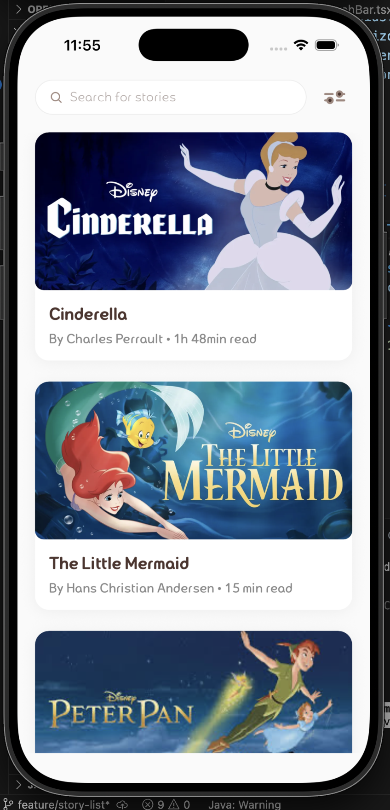
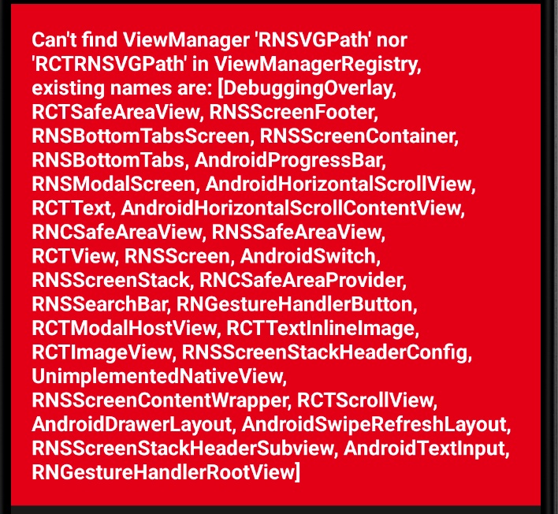

## React Native에서 SVG 아이콘 사용하기

### SVG 사용하는 방법


> 패키지 설치

```bash
yarn add react-native-svg
yarn add --save-dev react-native-svg-transformer
// npm install react-native-svg
// npm install --save-dev react-native-svg-transformer
```

<br>

> 파일 수정 `metro.config.js`

```jsx
const { getDefaultConfig, mergeConfig } = require('@react-native/metro-config');

/**
 * Metro configuration
 * https://reactnative.dev/docs/metro
 *
 * @type {import('@react-native/metro-config').MetroConfig}
 */
const defaultConfig = getDefaultConfig(__dirname);
const {
    resolver: { sourceExts, assetExts },
} = defaultConfig;
const config = {
    transformer: {
        babelTransformerPath: require.resolve('react-native-svg-transformer'),
    },
    resolver: {
        assetExts: assetExts.filter((ext) => ext != 'svg'),
        sourceExts: [...sourceExts, 'svg'],
    },
};

module.exports = mergeConfig(defaultConfig, config);

```

`transformer: { babelTransformerPath: ... }` 

-  번역기를 지정하는 부분

- 원래 Metro는 자바스크립트만 해석할 줄 알아서

- SVG 파일을 만나면 react-native-svg-transformer 라는 번역기를 써서 자바스크립트 코드로 바꿔줘라고 지정하는 것

`assetExts.filter((ext) => ext != 'svg')`

- 단순 이미지 목록에서 제외하기

 `assetExts`는 png, jpg처럼 그냥 파일 그대로 복사해서 쓸 이미지들 목록

 여기서 `svg`를 제거함(이제 svg는 단순 이미지가 아님)

`sourceExts: [...sourceExts, 'svg']`

- 소스 코드 목록에 추가하기

- `sourceExts`는 js, tsx, jsx처럼 ‘컴파일(번역)이 필요한 소스 코드’ 목록

- 여기에 `svg` 추가. 이제 앱은 SVG를 `App.tsx` 같은 소스 코드와 동급으로 취급

<br>

> 타입스크립트 선언 `declaration.d.ts`

없으면 파일 만들기

```tsx
declare module "*.svg" {
    import React from "react";
    import { SvgProps } from "react-native-svg";
    const content: React.FC<SvgProps>;
    export default content;
}
```

<br>

- 적용하기

```tsx
import { CloseIcon, FilterIcon, SearchIcon } from '../assets';

...
export const SearchBar = ({ value, onChangeText, onSubmit, onFilterPress}: Props) => {
    return (
	    ...
            <SearchIcon
                width={16}
                height={16}
                fill={Colors.textBody}
                style={{ marginRight: 8 }}
            />
      ...
    )
};

```

<br>


> 의존성 반영
- iOS

```bash
cd ios
pod install
```

시뮬레이터를 동작해보면 아이콘이 잘 나오는 것을 확인할 수 있다.



- Android

에뮬레이터에서는 에러가 났다.



**💡해결방법**

android 빌드 환경을 청소해주고, Yarn 기준으로 의존성을 다시 설치했다.

```bash
cd android
./gradlew clean

yarn add react-native-svg
yarn add --save-dev react-native-svg-transformer
```

에뮬레이터에서도 잘 뜨는 것을 확인할 수 있다!


